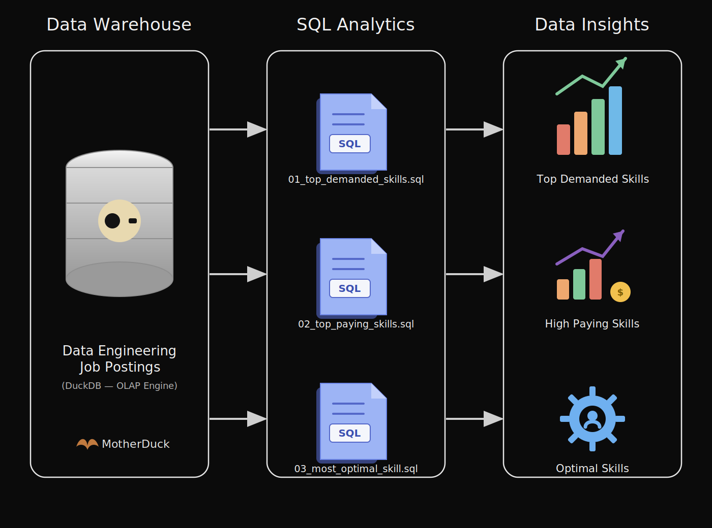
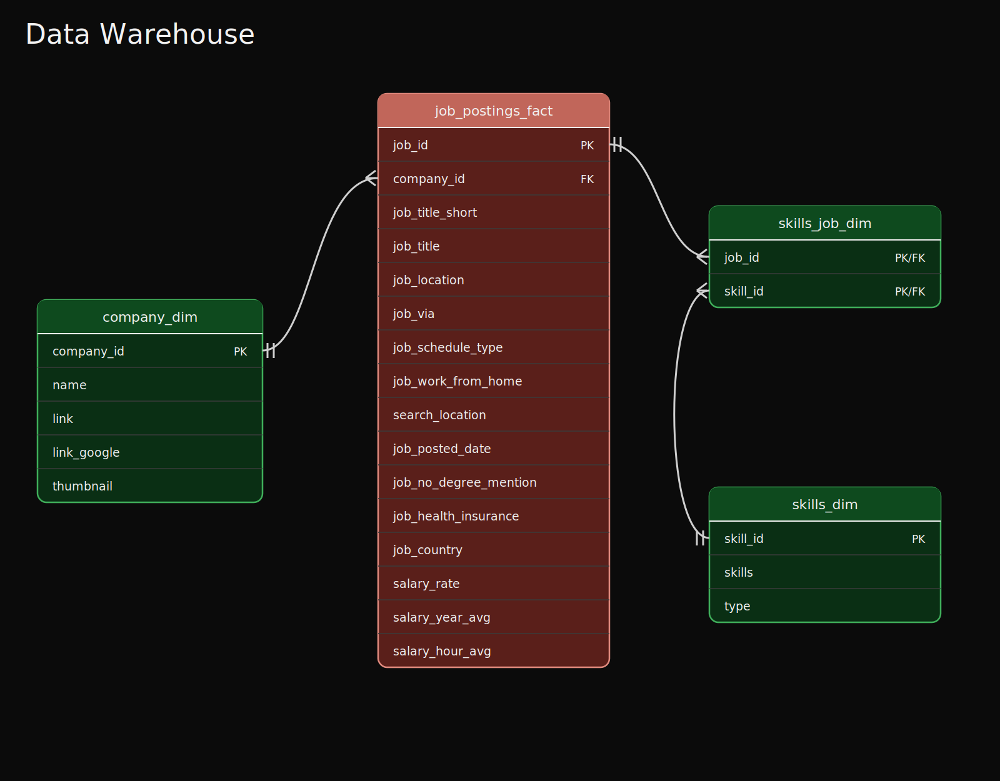

# Exploratory Data Analysis w/ SQL: Job Market Analytics

## EDA Project Overview



A SQL project analyzing the data engineer job market using real world job posting data. It demonstrates my ability to write production-quality analytical SQL, design efficient queries, and turn business questions into data-driven insights.

## 🧾 Executive Summary (For Hiring Managers)

✅ **Project scope:** Built 3 analytical queries that answer key questions about the data engineer job market
✅ **Data modeling:** Used multi-table joins across fact and dimension tables to extract insights
✅ **Analytics:** Applied aggregations, filtering, and sorting to find top skills by demand, salary, and overall value
✅ **Outcomes:** *TODO — fill in once queries are run (e.g. skill dominance, cloud trends, salary patterns)*

If you only have a minute, review these:
- [`01_top_demanded_skills.sql`](./01_top_demanded_skills.sql) – demand analysis with multi-table joins
- [`02_top_paying_skills.sql`](./02_top_paying_skills.sql) – salary analysis with aggregations
- [`03_most_optimal_skill.sql`](./03_most_optimal_skill.sql) – combined demand/salary optimization query

## 🧩 Problem & Context

Job market analysts need to answer questions like:
- 🎯 **Most in-demand:** Which skills are most in-demand for data engineers?
- 💰 **Highest paid:** Which skills command the highest salaries?
- ⚖️ **Best trade-off:** What is the optimal skill set balancing demand and compensation?

This project analyzes a data warehouse built using a star schema design. The warehouse structure consists of:



- **Fact Table:** `job_postings_fact` – central table containing job posting details (job titles, locations, salaries, dates, etc.)
- **Dimension Tables:**
  - `company_dim` – company information linked to job postings
  - `skills_dim` – skills catalog with skill names and types
- **Bridge Table:** `skills_job_dim` – resolves the many-to-many relationship between job postings and skills

By querying across these interconnected tables, I extracted insights about skill demand, salary patterns, and optimal skill combinations for data engineering roles.

## 🧰 Tech Stack

- 🐤 **Query Engine:** DuckDB for fast OLAP-style analytical queries
- 🧮 **Language:** SQL (ANSI-style with analytical functions)
- 📊 **Data Model:** Star schema with fact + dimension + bridge tables
- 🛠️ **Development:** VS Code for SQL editing + Terminal for DuckDB CLI
- 📦 **Version Control:** Git/GitHub for versioned SQL scripts

## 📂 Repository Structure

```
1_EDA/
├── 01_top_demanded_skills.sql    # Demand analysis query
├── 02_top_paying_skills.sql      # Salary analysis query
├── 03_most_optimal_skill.sql     # Combined demand/salary optimization
└── README.md                     # You are here
```

## 🏗 Analysis Overview

### Query Structure
1. **Top Demanded Skills** – Identifies the most in-demand skills for data engineer positions
2. **Top Paying Skills** – Analyzes the highest-paying skills with salary and demand metrics
3. **Optimal Skills** – Calculates an optimal score combining demand and median salary to identify the most valuable skills to learn

### Key Insights
*TODO — fill in once each query has been written and run against the dataset. Don't backfill numbers from someone else's analysis; these need to come from this project's own output.*

## 💻 SQL Skills Demonstrated

**Query Design & Optimization**
- **Complex Joins:** Multi-table `INNER JOIN` operations across `job_postings_fact`, `skills_job_dim`, and `skills_dim`
- **Aggregations:** `COUNT()`, `MEDIAN()`, `ROUND()` for statistical analysis
- **Filtering:** Boolean logic with `WHERE` clauses and multiple conditions (e.g. `job_title_short`, `job_work_from_home`, `salary_year_avg IS NOT NULL`)
- **Sorting & Limiting:** `ORDER BY` with `DESC` and `LIMIT` for top-N analysis

**Data Analysis Techniques**
- **Grouping:** `GROUP BY` for categorical analysis by skill
- **Mathematical Functions:** `LN()` for natural logarithm transformation to normalize demand metrics
- **Calculated Metrics:** Derived optimal score combining log-transformed demand with median salary
- **HAVING Clause:** Filtering aggregated results (e.g. skills above a minimum posting threshold)
- **NULL Handling:** Proper filtering of incomplete records (e.g. `salary_year_avg IS NOT NULL`)
- **Mathematical Functions:** `LN()` for natural logarithm transformation to normalize demand metrics
- **Calculated Metrics:** Derived optimal score combining log-transformed demand with median salary
- **HAVING Clause:** Filtering aggregated results (e.g. skills above a minimum posting threshold)
- **NULL Handling:** Proper filtering of incomplete records (e.g. `salary_year_avg IS NOT NULL`)
